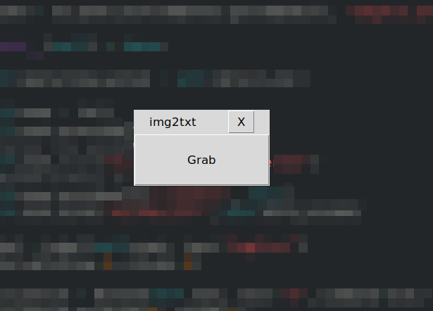

# img2txt
[](https://www.python.org/)
## Description
A simple Python software that uses OCR technology to convert images to text.

## Installation

### Step One: Installation Commands
```commandline
git clone https://github.com/wasfyelbaz/img2txt.git
cd img2txt
pip3 install -r requirements.txt
```

### Step Two: Installing required softwares

#### Windows
- Install [tesseract](https://tesseract-ocr.github.io/tessdoc/Installation.html) software for windows.
- Add it to the PATH variable.

#### Linux
- Install xclip utill
    ```commandline
    $ apt install xclip
    ```

## Usage
To start using the software just run:
```commandline
python3 img2txt.py
```

## GUI


## Idea
The idea was taken from the [blackbox](https://chrome.google.com/webstore/detail/blackbox-select-copy-past/mcgbeeipkmelnpldkobichboakdfaeon)
 extension for chrom, which did the exact same thing but only for chrome, but I thought hmmm .. Why don't I make a more generalized version of this that supports browsers, programs and basically any image that contains text.

